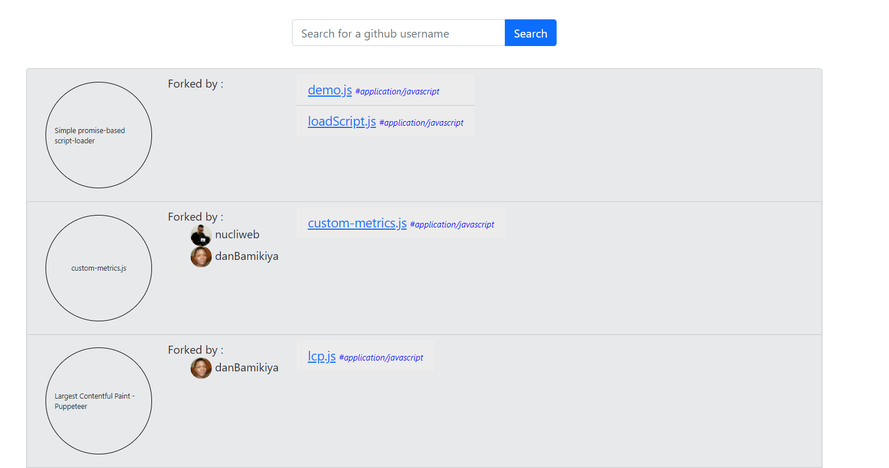
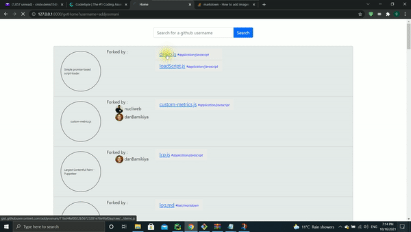

# SectorLabs
This repository contains a web application created for the second assignment of the Sector Labs interview for the position of Junior Full Stack Engineer

# First Functionality
Search a GitHub username and display all the public gists of that user

# Second Functionality
Display the filetype as a tag for each file from the gist

#Third Functionality 
Display the last three users that forked the given gist

# 1-3 Functionalities Image

# Fourth functionality
Access file content with a click

# Project logic
### A Django application with a single HTML page that can perform a search by the username of a GitHub user
### and with the given string it performs a http request to extract all the public gists of that user.
### From the result string are extracted each gist description together with the files name associated and
### last 3 users that forked the gist. 